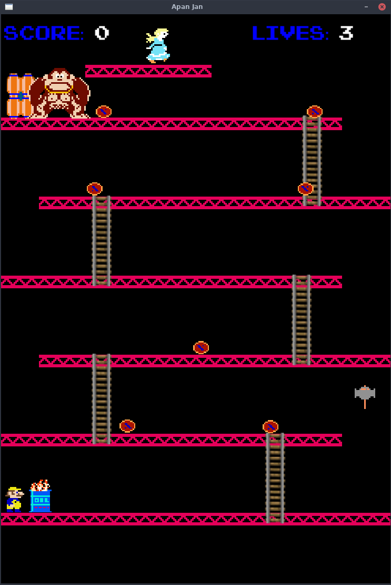
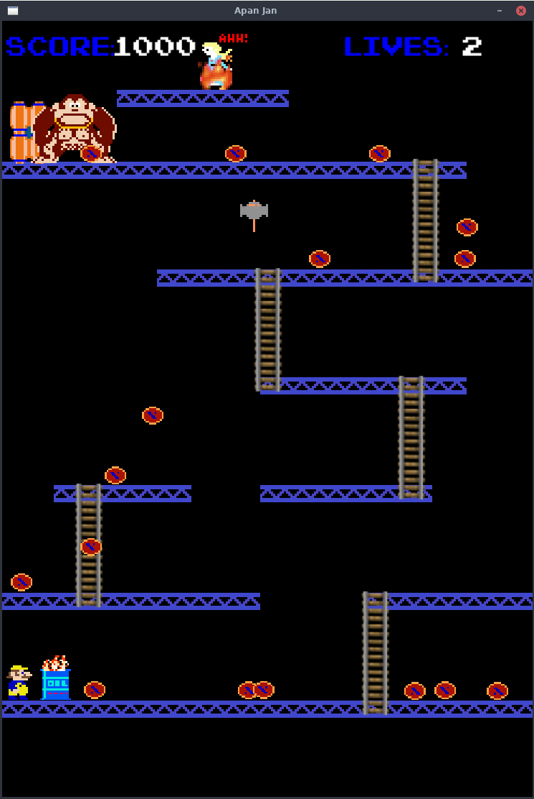

# 🐵 Donkey Kong Clone  

A 2D **Donkey Kong–inspired game** built in **C++** with **SDL2**.  
Developed as part of a university project to explore **game loops, collision handling, and object-oriented design**.  

---

## 🚀 Features  

- 🎮 **Gameplay**  
  - Control the player (Mario) to climb ladders, jump, and dodge barrels.  
  - Donkey Kong throws barrels at him.
  - Mario has to save his wife before it’s too late.
  - Score system & life tracking.  

- 🏗 **Technical Highlights**  
  - Implemented in **C++** with **SDL2** for rendering and input.  
  - Object-oriented design: `Player`, `Enemy`, `Platform`, `Barrel`, etc.  
  - Collision detection for platforms, ladders, and enemies.  

---

## 📂 Project Structure 
    ├── Makefile # Build instructions
    ├── README.md # Project description
    ├── src/ # (Game source code, classes & logic)
    ├── resources/ # (Sprites, images, sounds)
    └── includes/ # (Header files, constants, definitions)


## ⚙️ Installation & Setup  
1. **Clone the repository**  
   ```bash
   git clone https://github.com/M0rteza02/Donkey-Kong.git
   cd Donkey-Kong
2. Install SDL2 (Ubuntu/Debian)
    ```bash
    sudo apt-get install libsdl2-dev libsdl2-image-dev libsdl2-mixer-dev
3. Build the game
    ```bash
    make all
4. Run the game 
    ```bash
    make run

## 📸 Screenshots  

### Gameplay
  

 


## 📜 License

This project is licensed under the MIT License.